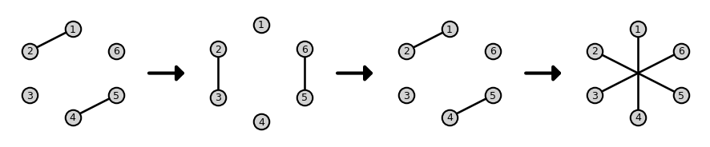

# Beyond Exponential Graph: Communication-Efficient Topologies for Decentralized Learning via Finite-time Convergence (NeurIPS 2023)
We propose the Base-(k+1) Graph, which is finite-time convergence for any number of nodes and maximum degree $k$,
Thanks to this property, the Base-(k+1) Graph enables Decentralized SGD to converge faster with fewer communication costs than the exponential graph.

Paper: [https://arxiv.org/abs/2305.11420](https://arxiv.org/abs/2305.11420)

## Dependency
```
conda env create --file conda_env.yaml
conda activate MT_env
```

## Visualization
We provide the notebook to visualize the Base-(k+1) Graph in `notebook/visualization.ipynb`.



Specifically, you can construct the Base-(k+1) Graph and visualize it as follows:
```
from base_graph import *
graph = BaseGraph(6, 1) # 6 nodes and maximum degree 1.
visualize(graph)
```

Moreover, the mixing matrices of the Base-(k+1) Graph can be get as follows.
```
print(graph.w_list)
```

## Decentralized Learning on Base-(k+1) Graph
We provide the implementation of the Base-(k+1) Graph with Decentralized SGD.
You can run the Base-2 Graph, whose maximum degree is 1, with Decentralized SGD by the following command.
```
python evaluate.py ./results --model vgg --optimizer gossip --dataset cifar10 --seed 0 --config ./config/25_node.json  --node_list 0 1 2 3 4 5 6 7 8 9 10 11 12 13 14 15 16 17 18 19 20 21 22 23 24 --nw one_peer_base --lr 0.1 --epoch 500 --alpha 0.1 --beta 0.9 --local_step 1 --batch 32
```
The configuration file `./config/25_node.json` is set up for an environment with eight GPUs.
Please rewrite it to your environment accordingly.
To plot the learning curves, we provide the notebook in `notebook/CIFAR10 + DSGD.ipynb`.

To reproduce the experimental results in our paper, we provide the bash script.
```
bash evalute_cifar10.sh
base evaluate_cifar100.sh
```


## Citation
```
@inproceedings{takezawa2023exponential,
      title={Beyond Exponential Graph: Communication-Efficient Topologies for Decentralized Learning via Finite-time Convergence}, 
      author={Yuki Takezawa and Ryoma Sato and Han Bao and Kenta Niwa and Makoto Yamada},
      year={2023},
      booktitle={NeurIPS}
}
```
